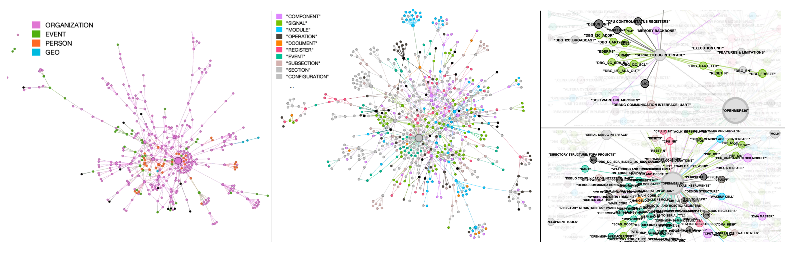

# AssertionForge

AssertionForge is a research prototype for **generating high‑quality SystemVerilog Assertions (SVAs)** from natural‑language specifications and RTL.  It constructs a joint knowledge graph that bridges the semantic gap between spec and implementation, then leverages LLMs to produce a focused test plan and candidate SVAs.

## Project Overview

AssertionForge enhances formal verification assertion generation with structured representation of specifications and RTL. The project follows a two-stage workflow:

1. **Knowledge Graph Construction (Indexing)**
2. **Test Plan and SVA Generation**

## Setup and Usage

Before running any command, always activate the virtual environment:

```bash
cd /<path>/<to>/src && conda activate fv
```

## Working with a New Design

For a new design, you'll need to set specific parameters in config.py for both stages. Here's what you need to modify:

### Common Parameters for New Designs

- `design_name`: A unique identifier for your design (e.g., 'my_new_design')
- Create appropriate paths for your design's files:
  - Specification document (PDF)
  - RTL code directory (containing .v files)
  - Output directory for the Knowledge Graph

## Stage 1: Knowledge Graph Construction (Indexing)

1. **Edit your `designs.yaml`:**

```yaml
task: build_KG        # 👈 switch to build_KG stage
design_name: uart     # 👈 name of your design

designs:
  uart:
    # You can provide either a single file OR multiple files as a list
    input_file_path: "/content/AssertLLM/spec/uart.pdf"   # 👈 single spec file
    file_path: "/content/AssertLLM/spec/uart.pdf"         # (alias for convenience)

    # Example with multiple files:
    # input_file_path:
    #   - "/content/AssertLLM/spec/uart.pdf"
    #   - "/content/AssertLLM/spec/uart_appendix.pdf"
    # file_path:
    #   - "/content/AssertLLM/spec/uart.pdf"
    #   - "/content/AssertLLM/spec/uart_appendix.pdf"

    design_dir: "/content/AssertLLM/rtl/uart"             # RTL directory
    KG_path: "/content/AssertLLM/spec/graph_rag_uart/output/graph.graphml"

build_KG:
  env_source_path: "/<path>/<to>/rag_apb/.env"                       # API key env file
  settings_source_path: "/<path>/<to>/rag_apb/settings.yaml"         # GraphRAG config
  entity_extraction_prompt_source_path: "/<path>/<to>/rag_apb/prompts/entity_extraction.txt"
  graphrag_local_dir: "/<path>/<to>/graphrag"
```
---

2. **Edit your `.env` file** (default: `/content/AssertionForge/src/.env`)

Add your **GraphRAG API key**:

```ini
GRAPHRAG_API_KEY=sk-your-api-key-here
```

This can be an API key from **OpenAI, Anthropic, Google, OpenRouter, etc.** depending on which backend you want to use.

---

3. **Edit your `settings.yaml` file** (default: `/content/AssertionForge/src/settings.yaml`)

Set the **default chat model** you want:

```yaml
models:
  default_chat_model:
    type: openai_chat        # or azure_openai_chat
    api_base: https://openrouter.ai/api/v1
    # api_version: 2024-05-01-preview
    auth_type: api_key       # or azure_managed_identity
    api_key: ${GRAPHRAG_API_KEY}   # loaded from .env
    model: x-ai/grok-4-fast:free   # 👈 set this to your desired model
```

* `type`: choose the provider type (e.g., `openai_chat`, `azure_openai_chat`).
* `api_base`: endpoint (e.g., OpenRouter, OpenAI, Azure, Anthropic).
* `model`: the **actual model name** (e.g., `gpt-4o`, `claude-3-sonnet`, `gemini-1.5-pro`, `x-ai/grok-4-fast:free`).

---

4. **Run the builder with CLI (instead of editing config.py):**

```bash
python main.py --task build_KG --design_name uart --designs_yaml designs.yaml
```

* `--task build_KG` → tells pipeline to build the KG
* `--design_name uart` → selects the design block from YAML
* `--designs_yaml` → points to your YAML file (defaults to `designs.yaml` if not given)

---

| **Note down the graphml file path which will be printed out after completion of the KG Builder step and give it to the `kg_path` under the designs section for you respective design**

| **Test plans will be saved in the log folder of Assertion Forge log saver, the `nl_plan` path will be printed after `Step 5`**

## Stage 2: Test Plan & Assertion (SVA) Generation

1. **Edit your `designs.yaml`:**

```yaml
task: gen_plan        # 👈 switch to plan + assertion generation
design_name: uart     # 👈 name of your design

gen_plan:
  generate_SVAs: true
  enable_context_enhancement: false
  max_prompts_per_signal: 10

  # (Optional) Provide architectural signals you want assertions for:
  valid_signals: ["baud_clk", "baud_freq"]

  # (Optional) Path to an existing or new SVA file
  sva_file_path: "/content/AssertLLM/output/property_goldmine.sva"

designs:
  uart:
    input_file_path: "/content/AssertLLM/spec/uart.pdf"
    design_dir: "/content/AssertLLM/rtl/uart"
    KG_path: "/content/AssertLLM/spec/graph_rag_uart/output/graph.graphml"
```

---

**Notes on behavior:**

* **If `valid_signals` are provided** → SVAs will be generated for those signals only.

* **If `valid_signals` are not provided** →

  1. The system looks for the signals defined in the **ports of the module inside the provided SVA file** (`sva_file_path`).
  2. If no SVA file is provided, the system will **automatically generate one** based on the design’s top module ports, and then use those signals.

* **If `sva_file_path` is provided** → SVAs will be written into that file.

* **If `sva_file_path` is not provided** → A new SVA file will be auto-created in the output directory and used for the process.

---

2. **Edit your `.env` file** (default: `/content/AssertionForge/src/.env`)

Make sure you have set your API key:

```ini
GRAPHRAG_API_KEY=sk-your-api-key-here
```

---

3. **Edit your `settings.yaml` file** (default: `/content/AssertionForge/src/settings.yaml`)

Choose the model you want to use for generation:

```yaml
models:
  default_chat_model:
    type: openai_chat
    api_base: https://openrouter.ai/api/v1
    auth_type: api_key
    api_key: ${GRAPHRAG_API_KEY}
    model: x-ai/grok-4-fast:free   # 👈 change to desired model (e.g. gpt-4o, claude-3, gemini-1.5-pro)
```

---

4. **Run the generator with CLI:**

```bash
python main.py --task gen_plan --design_name uart --designs_yaml designs.yaml
```

* `--task gen_plan` → runs plan + assertion generation.
* `--design_name uart` → selects the design block from YAML.
* `--designs_yaml` → points to your YAML config (defaults to `designs.yaml` if not given).

---

5. **Completion message**

* If SVAs are generated:

  ```
  Test plan and Assertion generation process completed.
  Nl Test Plan Files: ....
  SVA File: ....
  ```
* If SVAs are not generated:

  ```
  Test plan generation process completed.
  Nl Test Plan Files: ....
  ```
## Stage 3: Knowledge Graph (KG) Query & Usage

1. **Edit your `designs.yaml`:**

```yaml
task: use_KG          # 👈 switch to the Knowledge Graph usage stage
design_name: uart     # 👈 name of your design

use_KG:
  KG_root: "/<path>/<to>/data/apb/graph_rag/output/20240813-163015/artifacts"   # 👈 path to GraphRAG artifacts
  graphrag_method: "local"    # 👈 can be "local" or "api" depending on setup
  query: "What does PREADY mean?"  # 👈 required query to run against the KG

build_KG:
  env_source_path: "/content/AssertionForge/src/.env"
  settings_source_path: "/content/AssertionForge/src/settings.yaml"
  entity_extraction_prompt_source_path: "/content/AssertionForge/entity_extraction.txt"
  graphrag_local_dir: "/<path>/<to>/graphrag"

designs:
  uart:
    input_file_path: ["/content/AssertLLM/spec/uart.pdf"]
    design_dir: "/content/AssertLLM/rtl/uart"
    KG_path: "/content/AssertLLM/spec/graph_rag_uart/output/graph.graphml"
```

---

**Notes on behavior:**

* The **`use_KG` stage** enables querying and reasoning over the Knowledge Graph built during **Stage 1** (`build_KG`).

* The model used for answering the KG query is **automatically loaded** from the `settings.yaml` file defined under:

  ```yaml
  build_KG:
    settings_source_path: "/content/AssertionForge/src/settings.yaml"
  ```

* The API key and environment variables (e.g., `GRAPHRAG_API_KEY`) are fetched from the `.env` file located at:

  ```yaml
  build_KG:
    env_source_path: "/content/AssertionForge/src/.env"
  ```

* The **GraphRAG engine** reads from `use_KG.KG_root` — which should point to the **artifacts directory** generated during the KG building stage.

* The `graphrag_method` defines how to query:

  * `"local"` → To fetch information on localized information in a document.
  * `"global"` → To fetch the over all information from the document for a broader answer.

* The `query` field is **mandatory** when running `--task use_KG`.
  `KG_root` and `graphrag_method` are optional if they already exist in your YAML file.

---

2. **Edit your `.env` file** (default: `/content/AssertionForge/src/.env`)

Make sure your environment key is set correctly for the LLM backend:

```ini
GRAPHRAG_API_KEY=sk-your-api-key-here
```

This is the same API key used for both `build_KG` and `use_KG` stages.

---

3. **Edit your `settings.yaml` file** (default: `/content/AssertionForge/src/settings.yaml`)

Ensure that your model configuration under `models:` aligns with the one you wish to use for answering KG queries:

```yaml
models:
  default_chat_model:
    type: openai_chat
    api_base: https://openrouter.ai/api/v1
    auth_type: api_key
    api_key: ${GRAPHRAG_API_KEY}
    model: x-ai/grok-4-fast:free   # 👈 change if needed (e.g. gpt-4o, claude-3, gemini-1.5-pro)
```

> **Note:** The model and environment settings here are **inherited automatically** during the `use_KG` stage using the paths defined under `build_KG`.

---

4. **Run the KG Query CLI:**

```bash
python main.py --task use_KG --design_name uart --query "What does PREADY mean?"
```

* `--task use_KG` → triggers the Knowledge Graph reasoning and query mode.
* `--design_name uart` → selects the UART design section from YAML.
* `--query` → the natural language question to ask about the KG.
* Optional overrides:

  ```bash
  --KG_root "/path/to/graphrag_root_dir" 
  --graphrag_method local
  ```

---


## Parameter Details for New Designs

### Required Parameters

| Parameter | Description | Example Value |
|-----------|-------------|---------------|
| `design_name` | Unique name for your design | `"my_custom_asic"` |
| `input_file_path` / `file_path` | Path to specification PDF | `"/home/user/specs/my_design_spec.pdf"` |
| `design_dir` | Directory containing RTL (.v) files | `"/home/user/rtl/my_design/"` |
| `KG_path` | Path to KG from Stage 1 | Output path from Stage 1 |
| `valid_signals` | List of architectural signals | `['clk', 'reset', 'data_valid']` |

### Optional Configuration

| Parameter | Description | Default |
|-----------|-------------|---------|
| `DEBUG` | Enable faster processing (fewer signals) | `False` |
| `max_num_signals_process` | Limit number of signals to process | `float('inf')` |
| `max_prompts_per_signal` | Number of prompts per signal | `3` |
| `generate_SVAs` | Whether to generate SVA code | `False` |

## Important Notes

- The KG construction process may take some time depending on the size of the specification.
- Always check the console output for any errors or warnings during the process.
- For new designs, keep `generate_SVAs = False` since TCL files might not be provided.
- Always specify `valid_signals` with the actual architectural signals from your design.
- Architectural signals are typically input/output ports and architectural-level registers mentioned in the specification.

## Knowledge Graph Example



*Visualization of the KGs from **OpenMSP430** using Gephi. Node colors represent different entity types—modules, signals, etc.  Left: KG generated with the vanilla GraphRAG prompt.  Middle: KG produced by our domain‑customized prompt.  Right: two zoomed‑in views highlighting key entities and their labels.*


## Citation

If you build on AssertionForge, please cite our LAD 2025 paper:

```
@inproceedings{bai2025assertionforge,
  title={AssertionForge: Enhancing Formal Verification Assertion Generation with Structured Representation of Specifications and RTL},
  author={Bai, Yunsheng and Bany Hamad, Ghaith and Suhaib, Syed and Ren, Haoxing},
  booktitle={Proceedings of the IEEE International Conference on LLM-Aided Design (LAD)},
  address={Stanford, CA},
  year={2025}
}
```

*Accepted at LAD 2025, Stanford (June 26‑27, 2025).*

📄 **Paper:** [arXiv:2503.19174](https://arxiv.org/abs/2503.19174)


##  Acknowledgements

We deeply thank Vigyan Singhal for his technical guidance and support. We also acknowledge Cadence Design Systems for implementing the formal assertion-to-assertion equivalence checking in Jasper and for their many helpful discussions that contributed to the success of this project.

